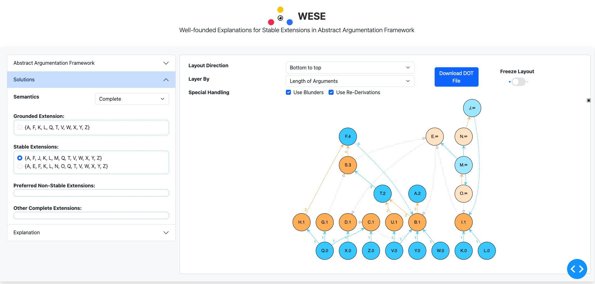

<div align="center">
    
    <h1 align="center">AF-XRAY</h1>
    <h3> Argumentation Framework eXplanation, Reasoning, and AnalYsis  </h3>
</div>

<!-- [](https://github.com/idaks/xray/actions/workflows/deploy.yml) -->




# Overview

AF-XRAY is a tool designed to explain abstract argumentation frameworks using provenance tracking, visualization techniques, and logic programming. For example, it can help users understand how stable extensions are derived based on the following logical rule:

$$
\text{Defeated}(x) \leftarrow \text{Attacks}(y, x), \neg \text{Defeated}(y).
$$

# Usage 

## Website
You can access the tool by visiting the following website ([go.illinois.edu/xray](https://go.illinois.edu/xray)) directly.


## Locally Development
> [!TIP]
> It is recommended to use a Conda environment.

Install the necessary package

```bash
git clone https://github.com/idaks/xray
conda create -n xray python=3.10
conda activate xray
conda install anaconda::graphviz
cd xray
pip install -r requirements.txt
python app.py
```
<!-- before deployment, you can test by running
```bash
gunicorn app:server
``` -->

## Docker Local Deployment
To run the application locally using Docker:

1. Build the Docker image:
```bash
docker build -t seanyl/xray:app .
```

2. Run the container with volume mounting for temp files:
```bash
docker run -p 8050:8050 -v $(pwd)/temp:/app/temp seanyl/xray:app
```

The application will be available at http://localhost:8050

Notes:
- The `-p 8050:8050` flag maps port 8050 from the container to port 8050 on your host machine
- The `-v $(pwd)/temp:/app/temp` flag mounts a local `temp` directory to store layout files
- To stop the container, press Ctrl+C in the terminal or run `docker stop <container_id>`


# License
The software is available under the MIT license.


# Acknowledgment
AF-XRAY is built upon [PyArg](https://github.com/DaphneOdekerken/PyArg)

# Citation

```bibtex
@inproceedings{xia2025afxray,
  title     = {AF-Xray: Visual Explanation and Resolution of Ambiguity in Legal Argumentation Frameworks},
  author    = {Yilin Xia and Heng Zheng and Shawn Bowers and Bertram Ludäscher},
  booktitle = {Proceedings of the Twentieth International Conference on Artificial Intelligence and Law (ICAIL 2025)},
  year      = {2025},
  pages     = {483--485},
  address   = {Chicago, IL, USA},
  publisher = {ACM},
  isbn      = {979-8-4007-1939-4}
}
```

# Contact
For any queries, please open an issue on GitHub or contact [Yilin Xia](https://yilinxia.com/)