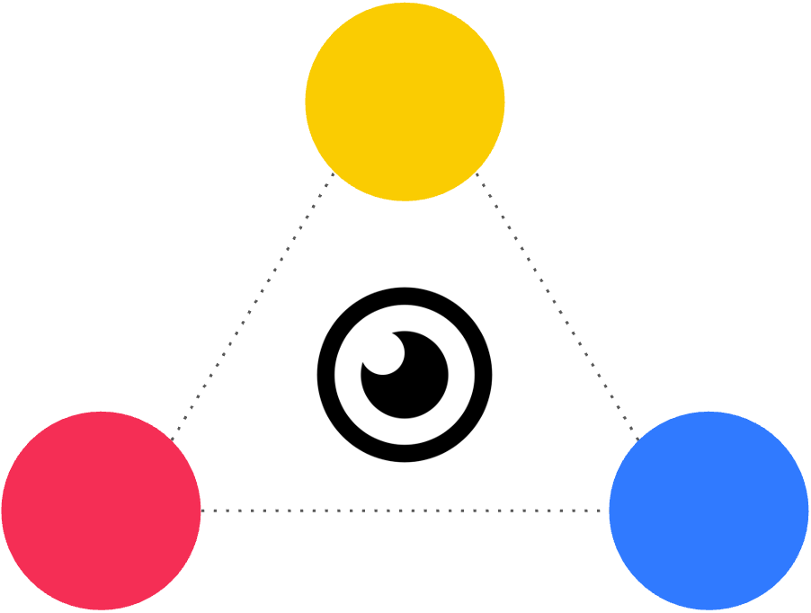

<div align="center">
    
    <h1 align="center">WESE</h1>
</div>

# Introduction

WESE (Well-founded Explanations for Stable Extensions in Abstract Argumentation Framework) is a tool designed to explain stable extensions using provenance tracking and visualization techniques. It helps users understand how stable extensions are derived based on the following logical rule under stable semantics:

$$
\text{Defeated}(x) \leftarrow \text{Attacks}(y, x), \neg \text{Defeated}(y).
$$

# Usage 

## Website
You can access the tool by visiting the following website (https://wese.onrender.com) directly. Please note that it may take some time to load, as the service automatically shuts down after long periods of inactivity.


## Locally Development
Install the necessary package
```bash
pip install -r requirements.txt
python app.py
```
before deployment, you need to test by running
```bash
gunicorn app:server
```

## Docker Manually Deployment
Rebuild the Docker Image
```bash
docker buildx build --platform linux/amd64 -t seanyl/wese:app .
```

Push the image to docker hub
```
docker push seanyl/wese:app
```

# License
The software is available under the MIT license.


# Acknowledgment
WESE is built upon [PyArg](https://github.com/DaphneOdekerken/PyArg)

# Contact
For any queries, please open an issue on GitHub or contact [Yilin Xia](https://yilinxia.com/)